# Rat Sightings in New York City


---

## Authors

*(Add links to LinkedIn / personal sites later)*

- [Krishna Aryal]()
  
- [Kevin Dao](https://daokevin06.github.io/)

- [Yael Eisenberg](https://www.linkedin.com/in/yael-eisenberg-6608609a/)

- [Ifeoluwa Solomon](https://www.linkedin.com/in/solomon-ifeoluwa-damilare/)

---

##  Table of Contents</p>

1. [Quick Start](#quick-start)  
2. [Results and Further Work](#results-and-further-work)  
3. [Description](#description)  
4. [Geographic Level](#geographic-level)  
5. [Data Sources](#data-sources)  
6. [Literature](#literature)  
7. [Exploratory Data Analysis](#exploratory-data-analysis)  
8. [Modeling Approach](#modeling-approach)  
9. [Project Directory](#project-directory)  
10. [Example of Workflow](#example-of-workflow)  

## Quick Start

0. Clone the repository

   ```bash
   git clone <repo-url>
   cd spring-2026-rat-activity-nyc
   ```

1. Next, one should install the packages. We provided two ways to do this depending on the user's preferences. (a) would be to run 
    ```bash
    pip install -r requirements.txt
    ```
    and option (b) is to go to the [notebooks/package_installs.ipynb](notebooks/package_installs.ipynb) and run it to download the necessary packages.

2. Still go to [notebooks/package_installs.ipynb](notebooks/package_installs.ipynb) and run the notebook and check everything runs correctly.

3. If one is seeking just the two week forecast of rat sightings, then go to [scr/data/download_recent_data.ipynb](scr/data/download_recent_data.ipynb) and run the notebook to download the most recent data off the web. Then, go to [notebooks/forecast.ipynb](notebooks/forecast.ipynb) and run the whole notebook. The notebook should have a runtime of approximately 10 seconds. Scroll to the bottom of the notebook for the forecasts. Note that due to computational complexity and runtime, we have not chosen to use the "best model" (i.e. models with the lowest mean RMSEs following our evaluation method) for every borough in this notebook.

## Results and Further Work

For a detailed description of the results of our modeling work and for more on further work that might be done, please refer to [results/summary.md](results/summary.md) and [results/furtherwork.md](results/furtherwork.md). Due to lack of space, we have opted to collect the details in those markdown files.


## Description

The New York City (NYC) rat is considered a cultural symbol of NYC. 
It is estimated that there are about 3 million rats in NYC and in 
recent history, the number of rats has become incredibly problematic. 
Rats spread disease, attack small infants and children, spread waste, 
eat and steal food, and can cause infrastructure damage. Among other things, [Mayor Eric Adams established the Office of Rodent Mitigation](https://www.nyc.gov/mayors-office/news/2025/12/mayor-adams-signs-executive-order-establishing-office-of-rodent-) (which was later [revoked by Mayor Mamdani](https://www.ibtimes.co.uk/what-are-executive-orders-mayor-zohran-mandani-revoked-how-it-affects-nyc-1767594)) and NYC began its ["trash revoluation"](https://secretnyc.co/nyc-trash-bin-laws-fines-june-2026/). There is some hope that extended winters due to climate change and extreme cold might cull the rat population. Furthermore, the widespread adoption of better trash bins and better waste management procedures has led to notably 
rat problems. The big rat problem has also motivated [Transit to track rodent sightings on subway cars](https://transitapp.com/rats).

In this project, we would like to understand 311 rat sightings in NYC. The main question(s) we found ourselves attempting 
to answer is

>**Questions:** 
>
>Can one predict the future number of rat sightings reported to 311 for each day for the next 14 days at a citywide and borough level? 
>
>How can one improve these predictions by utilizing weather data and various engineered features? 
>
> How differently do the models perform on each borough?

As part of attempting to answer this question, we found ourselves considering 
rat inspection data, the question of forecasting at the ZIP code level, 
trash collection data, and catch basin data. We did not end up using all of this information
due to time and computational constraints, but these preliminary efforts might be useful
for future endeavors.


## Folder Status

| Borough/Level | Notebook | Status |
|---------|----------|--------|
| Bronx & Queens | `notebooks/bronx_and_queens/` | Complete |
| Brooklyn | `notebooks/brooklyn/` | Complete |
| Manhattan | `notebooks/manhattan/` | Complete |
| Staten Island | `notebooks/staten_island/` | Complete |
| Citywide | `notebooks/citywide/` | Complete |

---

## Data Sources

The data we gathered comes from NYC Open Data and the IRS. Not all of this data ended up being used for our forecasting purposes, but could be used in future work. There is a [notebook](scr/data/download_recent_data.ipynb) which downloads some of this data. The raw data can be found in [this folder](scr/data). Subfolders *not* starting with "cleaned_" contains the raw data.

| Dataset | Source | Description |
|---------|--------|-------------|
| Rat Sightings | [NYC Open Data](https://data.cityofnewyork.us/Social-Services/Rat-Sightings/3q43-55fe) | 311 Rat Sightings |
| Rat Inspections | [NYC Open Data](https://data.cityofnewyork.us/Health/Rodent-Inspection/p937-wjvj) | Rat Inspections |
| Catch Basins | [NYC Open Data](https://data.cityofnewyork.us/Environment/Catch-Basin/qxgt-r7dq) | Location of Catch Basins |
| IRS Income Data | [IRS SOI Tax Stats](https://www.irs.gov/statistics/soi-tax-stats-individual-income-tax-statistics) | ZIP-Level Income Data |
| DSNY Monthly Tonnage Data | [NYC Open Data](https://data.cityofnewyork.us/City-Government/DSNY-Monthly-Tonnage-Data/ebb7-mvp5/about_data) | Tonnage Data for Waste |
| 2010-2019 311 Reports| [NYC Open Data](https://data.cityofnewyork.us/Social-Services/311-Service-Requests-from-2010-to-2019/76ig-c548/about_data) | 311 Reports
Imported as needed | [Open Meteo](https://open-meteo.com/) | Weather Data
---

## Literature

There is an impressive amount of literature focused on understanding 
rat activity in New York City. We highlight some of them since they 
are worth a read. Included also are some recent news articles that 
might be relevant to someone interested in rat sightings in NYC. 
In recent years, NYC has also implemented new sanitation and trash 
rules. Awareness of city policies will and must play a role in our 
modeling efforts.

**Research Papers:**
- [Rat sightings in New York City are associated with neighborhood sociodemographics, housing characteristics, and proximity to open public space](https://doi.org/10.1371/journal.pone.0227057)
- [Computational Urban Ecology of New York City Rats](https://doi.org/10.1371/journal.pone.0227057)

**News Articles:**
- ["If it's cold, they stop mating": New York City rat population may be on the decline](https://www.theguardian.com/us-news/2026/feb/28/new-york-city-rat-population-decline)
- ["NYC Rats Are Fleeing – for an Incredible 12 Straight Months!"](https://www.nyc.gov/site/dsny/news/25-039/nyc-rats-fleeing-an-incredible-12-straight-months-#/0)
- [Official NYC Bin Availability Expands Citywide Ahead of June 2026 Compliance Deadline](https://www.nyc.gov/site/dsny/news/26-016/official-nyc-bin-availability-expands-citywide-ahead-june-2026-compliance-deadline)

---

## Exploratory Data Analysis

For our exploratory data analysis, we focused on trends in rat sightings reports. Initially, we had also considered extra data such as rat inspections, the location of catch basins, income levels in each borough, and trash collection in NYC. Due to limited time, our modeling attempts ended up only using rat sightings data and weather data. For more on our exploratory data analysis and what we observed, see [this notebook](notebooks/eda.ipynb).

Our first observation was the seasonality of rat sightings. Every borough experienced increased rat sightings during the months of June, July, and August, and a decrease in rat sightings during the months of November, December, January, and February.

<p align="center">
  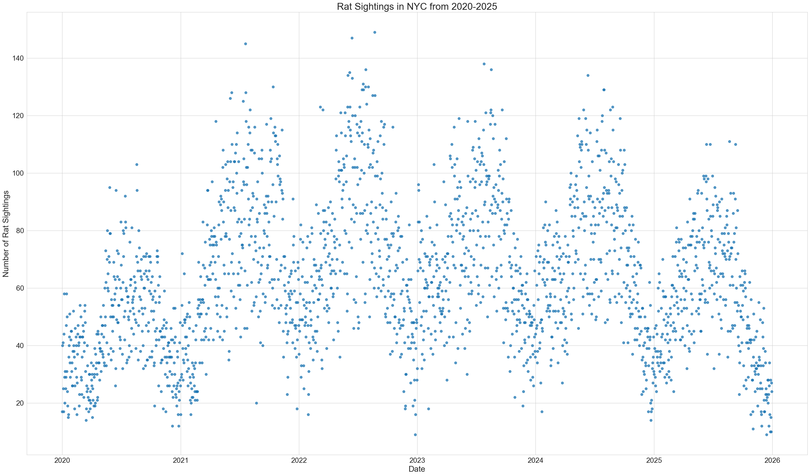
</p>

<p align="center">
  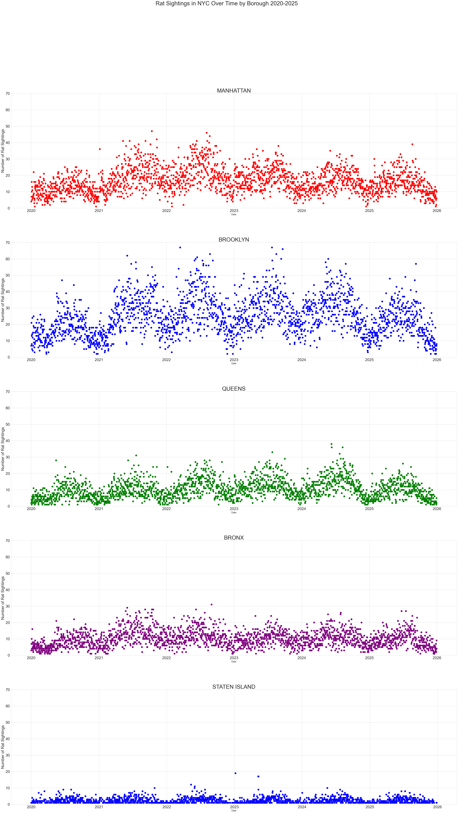
</p>

One can see this in the cumulative number of rat sightings by month.

<p align="center">
  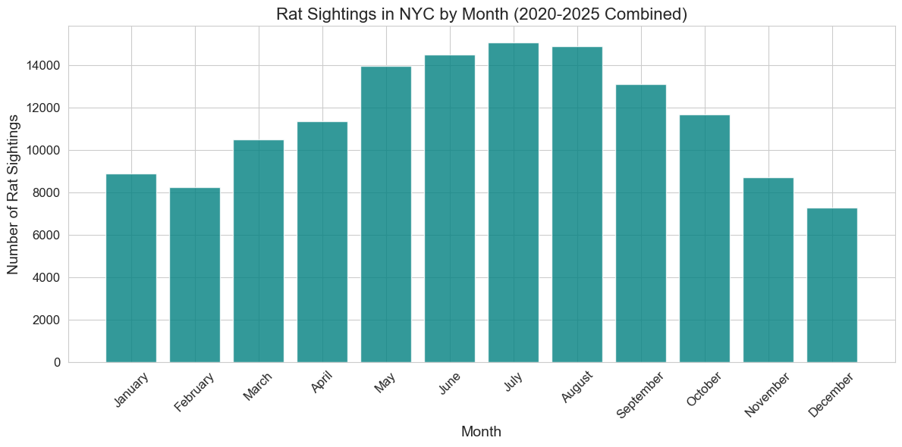
</p>

It is also known that weather plays a major role in rats abilities to reproduce. We collected the average temperature by day measured 2 meters above the ground in Manhattan. The temperature fluctuations lines up with the number of observed rat sightings per day.

<p align="center">
  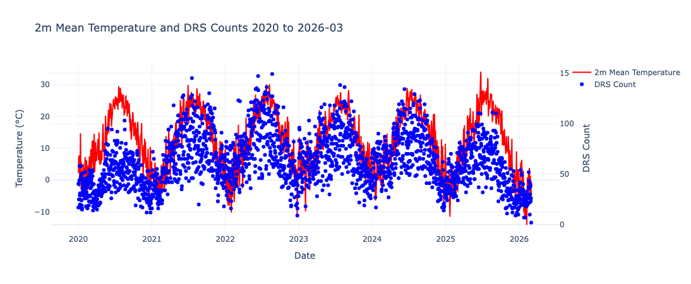
</p>


The number of rat sightings also exhibited changes in trend. For the years 2020 - 2022, we saw a steady increase in the number of reported rat sightings. One might speculate that this was due to relaxing rules regarding the COVID-19 lockdowns. However, starting in 2023, we saw a steady decrease in rat sightings. Part of this might be explained by renewed efforts by the city to deal with the rat problems e.g. the introduction of new laws regarding trash containiners in 2024. 

<p align="center">
  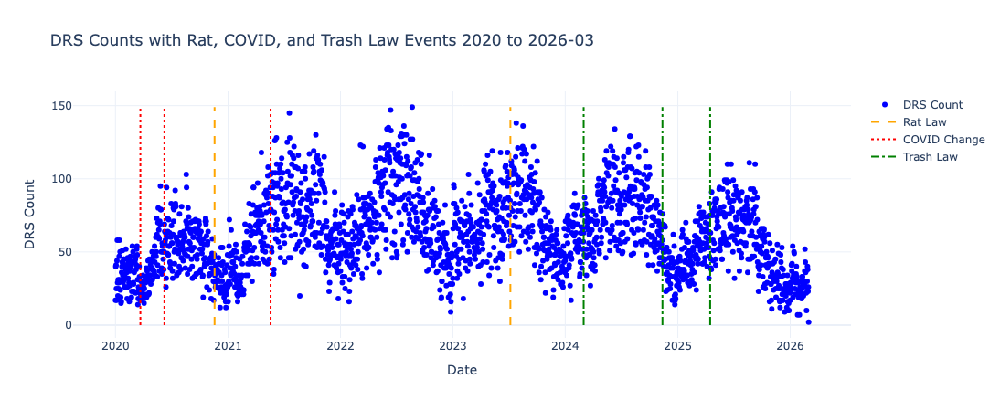
</p>

<p align="center">
  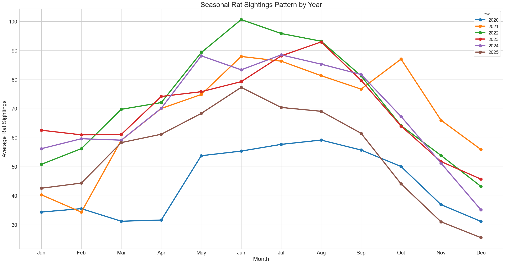
</p>

One also has to account for the influence of holidays. 311 rat sightings reports are not jus influenced by ract activity and populations, but also by human behavior. One can see this by looking at a boxplot of rat sightings on holidays versus nonholidays as well as considering the distribution of number of rat sightings each day.

<p align="center">
  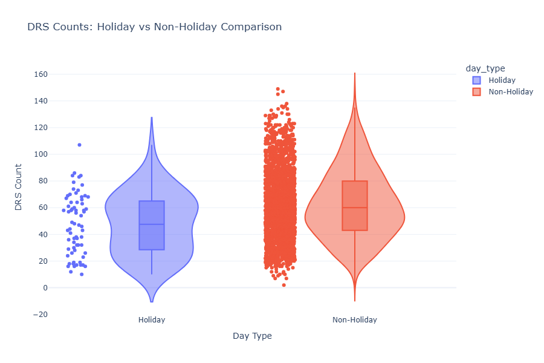
</p>

Even the days leading up to a holiday and the days after a holiday can have an influence on the number of reports.  In the following plot, we considered the average daily sightings in days leading up to a holiday and the days after. In shaded red is a one day window. We see a large dip before a federal holiday and then a large increase in the days that follow. This could partly be explained by human behavior: people do not want to call 311 during a holiday and wait until the days after to make the call. There does not seem to be major influence from the holiday outside a 7 day window before and after a federal holiday.

<p align="center">
  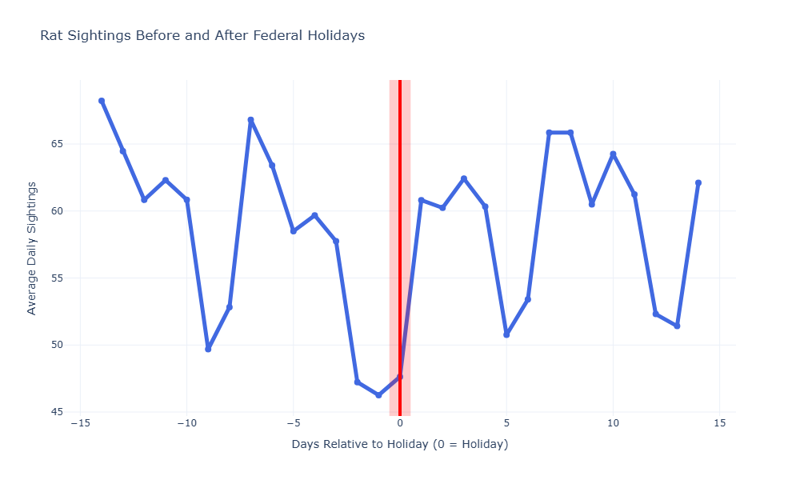
</p>

In line with our expectation that human behavior should play a role, we also expected there to be drops in reports on the weekends and Friday. Considering the average daily rat sightings by day of the week, we see that the average on Sundays and Saturdays are about 10 reports while every other day the average is about 12-15.

<p align="center">
  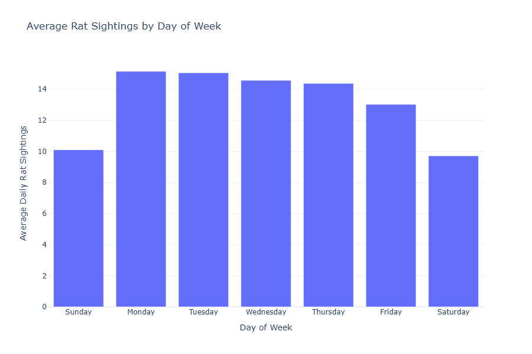
</p>

Lastly, the number of rat sightings reported in the past can have an influence. We provide ACF and PACF plots of daily rat sightings in NYC. One would expect such influence given that the average rat reproductive cycle ranges from 6-12 weeks. The increase in the ACF as one approaches a lag of 365 is also expected due to the yearly seasonality of the data.

<p align="center">
  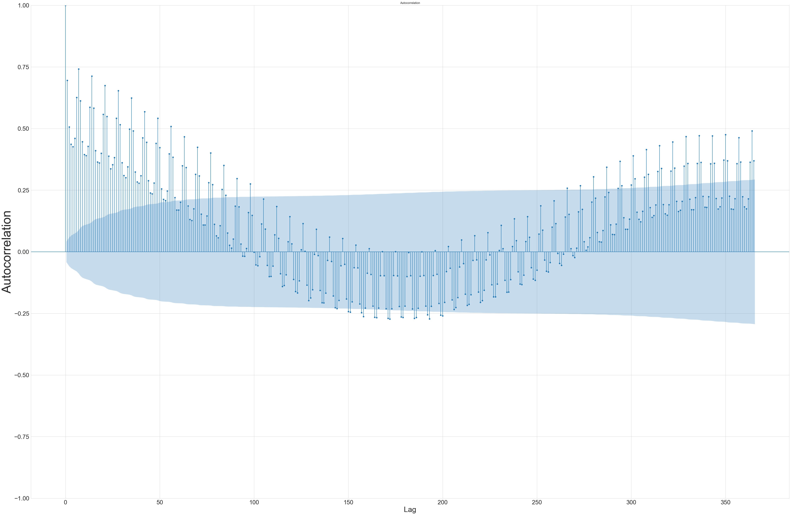
</p>

<p align="center">
  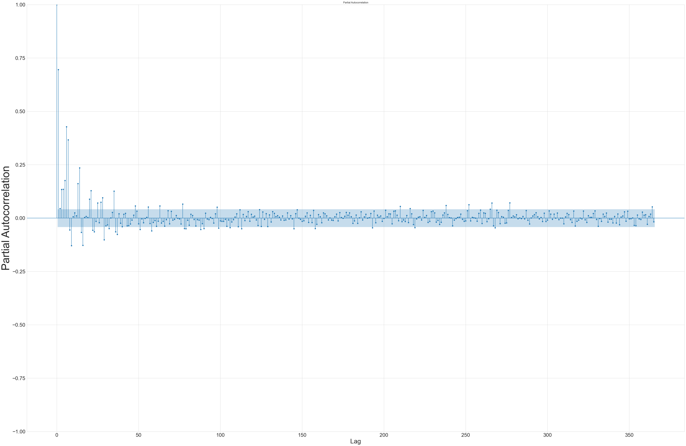
</p>


## Modeling Approach

We settled on the problem of forecasting the number of rat sightings with a forecast horizon of 14 days. This lines up with biweekly payschedules and lets us ensure that we can (a) capture weekly seasonality in our forecasts and (b) reduce the amount of computations needed to be done in our cross-validation scheme which we will discuss below.

0. Our main choice of **KPI** was to use root mean squared error (RMSE). We chose RMSE to keep the same magnitude since we wanted a sense of "how off was our forecast by day?". We also wanted some sensitivity for large errors as being able to predict the spikes in rat sightings has practical importance. Our choice was also partly motivated by our cross-validation scheme (see 3. below). Since RMSE keeps the same unit as the target, we can take the average of the RMSEs of each day of our fold and get a sense of how well our models performed on each fold.

1. We used the rat sightings data from 2020-01-01 all the way until 2026-02-28 inclusive. At the start of the project, we chose 2026-02-28 as our cutoff date for modeling attempts because there is typically a lag in updating the Open NYC 311 dataset.

2. Because we wish to forecast with 14 day forecast horizons and we have daily data, we chose a walk-forward cross validation scheme of 26 steps and test sizes of 14. Here, the choice to forecast 14 days instead of 7 allows us to instead pick 26 steps to get to 364 days which is almost a full year.

3. We held out the data for 2025-03-01 to 2026-02-28 and did our modeling on the data from 2020-01-01 to 2025-02-28. We chose to hold out a full year since we want to have a full year to evaluate our final models on.

4. As a baseline, we chose the seasonal average model. The data shows strong yearly seasonality so we chose a seasonal average model which looks back 4 years and considers a 4 day window. The performance of this baseline model for each borough and at the citywide level can be found in [this notebook](notebooks/baselines.ipynb).

5. We focused mainly on doing daily forecasts. However, considering weekly rat sightings could smooth out the influence of outliers. Initial efforts towards working with weekly data can be found [in the "weekly_models" folder](notebooks/weekly_models). In our exploratory data analysis, we also saw that Staten Island had sparse data and so considering weekly could help. Some initial efforts to do this can be found in this [notebook](notebooks/staten_island/4models_staten_island_weekly.ipynb) and this [notebook](notebooks/staten_island/5models_statenIsland_prophet_weekly.ipynb).

6. We considered a wide variety of models. Besides the Seasonal Average Model, we also considered using a Year Ago Rolling 4 Week Average which predicts the rolling 4 week average from  last year. More complex modeling tools we tried were: SARIMAX, Prophet, NeuralProphet, XGBoost, Holt-Winters, Year Ago Rolling 4 Week Average. In some cases, we also considered models that combined two or more models such as using Prophet to make the initial forecast and then use XGBoost to improve the forecast by having XGBoost try to predict the residuals. In the case of modeling for Queens and Bronx, we tried Ridge Regression and an Ensemble Model which took the average of Prophet, Ridge Regression, XGBoost, and SARIMA.


7. *Why Prophet?* As we understand it, Prophet uses a [decomposition of time series](https://en.wikipedia.org/wiki/Decomposition_of_time_series) but has features that appeared relevant to our situation. For example, Prophet is able to account for [holidays and special events](https://facebook.github.io/prophet/docs/seasonality,_holiday_effects,_and_regressors.html#modeling-holidays-and-special-events), for multiple seasonalities at once such as weekly and yearly seasonality, and for [changes in trend](https://facebook.github.io/prophet/docs/trend_changepoints.html). The change in trend can be observed at the citywide level in an STL decomposition.

<p align="center">
  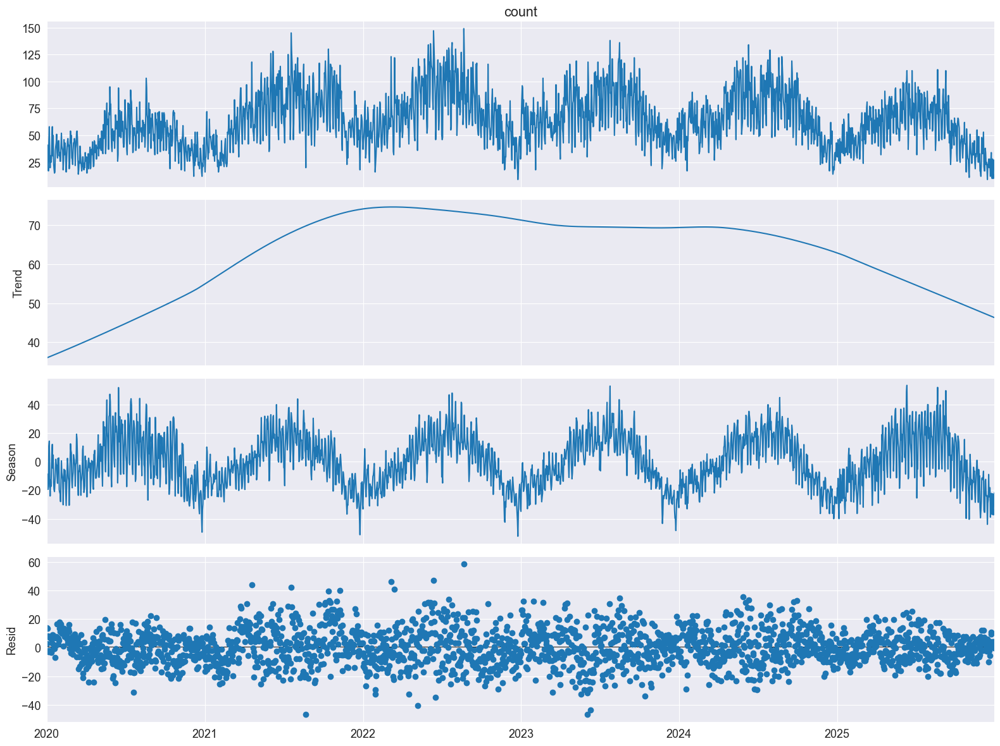
</p>


For more details on our modeling approach, please refer [here](notebooks/evaluation_plan.md).

## Project Directory

```text
spring-2026-rat-activity-nyc/
├── notebooks/
|   ├── bronx_and_queens/ # Notebooks modeling for Bronx and Queens
│   ├── brooklyn/ # Notebooks modeling for Brooklyn
|   ├── citywide/
|   |   ├── 0baseline.ipynb # Collects the Seasonal Average Forecast
|   |   ├── 1modeling_experiments.ipynb # Initial Modeling Comparisons
|   |   ├── 2neural_solo_prophet.ipynb # Compare Prophet vs NeuralProphet
|   |   ├── 3xgboosted_prophet.ipynb # Tune XGBoost + Prophet Model
|   |   ├── 4tune.ipynb # Tune NeuralProphet
|   |   ├── 5evaluation.ipynb # Evaluation of Hybrid Model on Holdout
|   |   ├── extra_modeling_with_more_data.ipynb # Model with Pre2020 Data
|   |   ├── model_neural.db # Optuna Study Results of NeuralProphet
|   |   └── xgprophet_model26.ipynb # Optuna Study Results of Hybrid Model
|   ├── manhattan/
|   |   ├── 0baselines.ipynb # Collects the Seasonal Average Forecast
|   |   ├── 1modeling_experiments.ipynb # Initial Modeling Comparisons
|   |   ├── 2neural_solo_prophet.ipynb # Compare Prophet vs NeuralProphet
|   |   ├── 3xgboosted_prophet.ipynb # Tune XGBoost + Prophet Model
|   |   ├── 4evaluations.ipynb # Evaluation of Final Model on Holdout
|   |   ├── model_neural.db # Optuna Study Results of NeuralProphet
|   |   └── xgprophet_model26.ipynb # Optuna Study Results of Hybrid Model
|   ├── staten_island/ # Notebooks modeling for Staten Island
|   ├── weekly_models/ # Notebooks with Initial Work on Forecasting Weekly Average
|   ├── baselines.ipynb # Notebook with Baseline Model Performance
|   ├── eda.ipynb # Notebook on EDA
|   ├── evaluation_plan.md 
|   ├── forecast.ipynb # Notebook Probiding 2 Week Forecasts
│   └── package_installs.ipynb # Notebook to Install Necessary Files
├── results/
|   ├── eda/ # Folder Containing .pngs from EDA
│   ├── modeling/ # Folder Containing Modeling Results
|   ├── furtherwork.md # Markdown Describing Furtherwork to be Done
│   └── summary.md # Markdown Summarizing the Project
├── scr/ 
│   ├── cleaning/ # Notebooks for Cleaning Data
│   ├── features/ # Notebooks with Work on Studyng Features
│   └── data/ # Holds Our Data 
├── LICENSE
├── README.md
└── requirements.txt
```


## Example of Workflow

We aimed to do a citywide forecast, and a forecast for each borough. Due to their distinct behavior, there will be variations in the models chosen and the work-flow. To get a general idea, we explain the workflow for Manhattan.

- [0baselines.ipynb](notebooks/manhattan/0baselines.ipynb) This first notebook contains the baseline model. This notebook is technically redundant since we had gathered the baseline models in [this notebook](notebooks/baselines.ipynb) already and then compared the baseline once more in [1modeling_experiments.ipynb](notebooks/manhattan/1modeling_experiments.ipynb).

- [1modeling_experiments.ipynb](notebooks/manhattan/1modeling_experiments.ipynb) This notebook first starts by loading the data set on rat sightings and cleans it by grouping rat sightings by day and has target value being the number of rat sightings of that day. We truncate the data so that we only use 2020-01-01 to 2025-02-28 data. A TimeSeriesSplit is made according to our cross-validation scheme of 14-day test sizes with 26 folds/steps. We compute the RMSEs and MAPEs of each model on each fold and then compute the average RMSEs and MAPEs. All of this is collected into a dataframe displayed below. We observe that Prophet had the smallest mean RMSE and smallest MAPE. We also visualize the performance of each model over each fold. Holt-Winters performs consistently poorly while Prophet performs very well overall. There are only two folds where Prophet does worse than the baseline model.

<p align="center">
  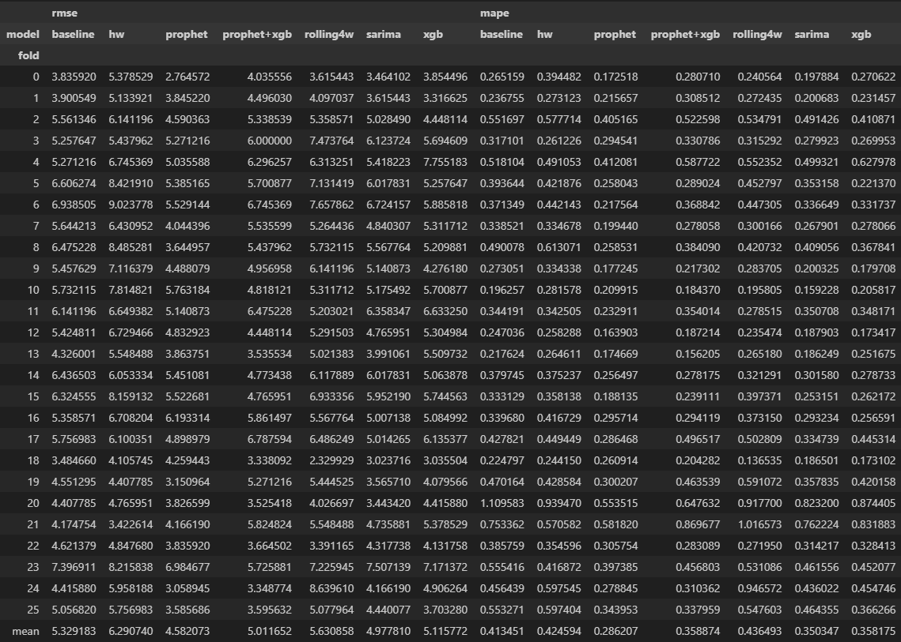
</p>

<p align="center">
  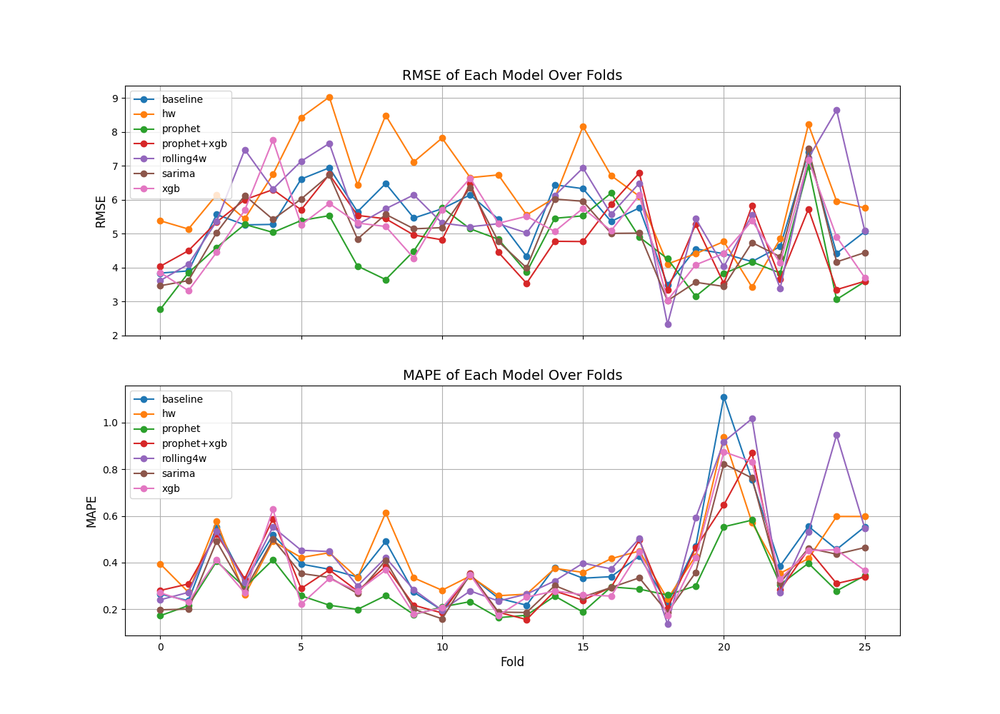
</p>

- [2neural_solo_prophet.ipynb](notebooks/manhattan/2neural_solo_prophet.ipynb) We observed in the previous notebook that Prophet performed the best. We try to improve on that by tuning Prophet and considering NeuralProphet. We use Optuna and save results to [model_neural.db](notebooks/manhattan/model_neural.db). The improvement in mean RMSE (~0.01) was not significant enough to justify the added computational cost.

<p align="center">
  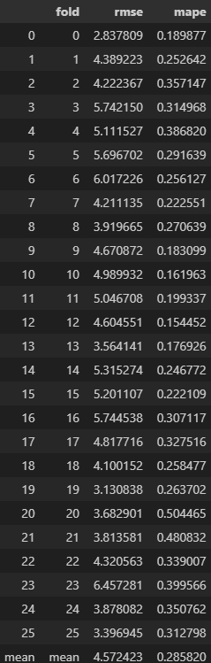
</p>

- [3xgboosted_prophet.ipynb](notebooks/manhattan/3xgboosted_prophet.ipynb) We consider an XGBoost + Prophet hybrid model. Prophet captures trend and seasonality, while XGBoost attempts to improve predictions using additional features and Prophet outputs. In this case, performance worsened.

<p align="center">
  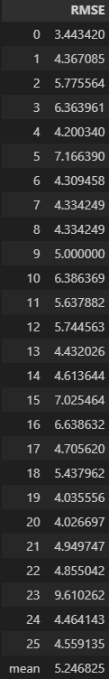
</p>

- [4evaluations.ipynb](notebooks/manhattan/4evaluations.ipynb) Given previous results, we select Prophet as the final model for Manhattan forecasting. We evaluate it on the holdout period 2025-03-01 to 2026-02-28 using 26 folds and 14-day forecast windows.

<p align="center">
  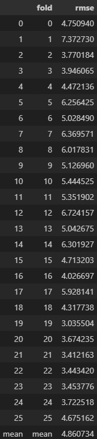
</p>
