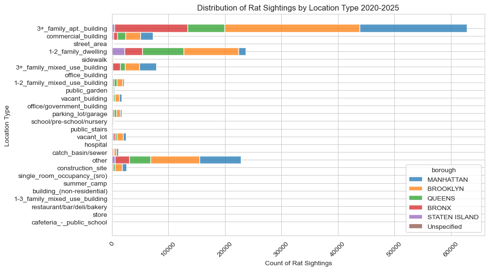
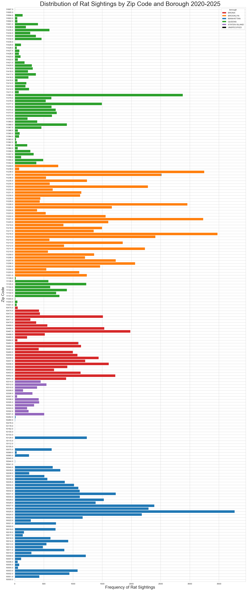

# Furtherwork

There is still a lot left to do and finding improvements to the models seems very possible. We outline some ways in which the results might be improved.

## General Improvements

There are some obvious general improvements that can be made right off the bat.

1. Feed the models with more data to see if the models improve. At the moment, we had focused on data after 2020-01-01 inclusive.  One might consider adding data from 2010-2019 and varying the cutoff date for data that we feed the models.

2. We had collected data involving 311 rat inspections, the location of catch basins, trash collection data, and income data from the IRS. We did not utilize the data from these datasets in our modeling efforts, but there are some glaring trends. We present some observations from our exploratory data analysis and highligh what we found to be interesting.

  

    First off, we have the following regarding the distribution of rat sightings by location type. The data shows, besides "other", the most common location types involved were residential buildings. So, perhaps including data on the number of residential buildings in each borough by month could improve the models.

    The other interesting thing to observe is the lack of entries for "sidewalk" and "steet_area" sightings. Rats are seen very often in the streets of NYC and the lack of entries indicates that reports of rats are only ever made if they are found in a building or other structure humans frequent.

    The third interesting thing we found was the number of entries in "other". It is not an insignificant amount of rat sightings and pinpointing what exact sort of location those sightings were seems important if one wishes to use location types as features for modeling.

  

    Above we have displayed the distribution of rat sightings by ZIP code from 2020-2025. 

    We notice that in Queens, there are ZIP codes in which not a single rat sighting report has ever been made in those years. For example, ZIP code 11697 which corresponds to [Breezy Point](https://en.wikipedia.org/wiki/Breezy_Point,_Queens) in Queens. There are roughly 4,000 people that live there. Geographically, it sits in Rockaway Peninsula and so is rather secluded. One can come up with a long list of possible explanations, but more up close research would be needed to explain why. 

    The same can be applied to any ZIP codes above for which no rat sightings were reported.

    Each borough also appears to have a select few ZIP codes in which the number of rat sightings are most dominant. For example, in Manhattan 10025 dominates. A strong understanding of why this is the case might offer more accurate forecasts. 

3. More tuning of the model parameters and features might offer improvements. For example, in [the notebook for the hybrid model for Manhattan](https://github.com/Erdos-Projects/spring-2026-rat-activity-nyc/blob/main/notebooks/manhattan/3xgboosted_prophet.ipynb), we see that it is possible to reduce the mean RMSE to about 4.3 by tuning hyperparameters and features. This beats the mean RMSE of 4.58 coming from Prophet alone.

4. The inclusion of rat inspection data might improve models. The [Terms and Pactices](https://www.nyc.gov/site/doh/health/health-topics/rat-inspections.page) of rat inspections indicate that they are made in response to 311 rat sightings and following the neighborhood index program. A lot of useful information can be on the page for the [Neighborhood Indexing Program](https://www.nyc.gov/site/doh/health/health-topics/rat-maps-and-data-rat-indexing.page) which one might be able to use.

5. Use domain knowledgee regarding rat behavior such as their [genetic adaption](https://pmc.ncbi.nlm.nih.gov/articles/PMC7851592/) to NYC conditions. The genetic divide between [uptown and downtown rats](https://www.npr.org/2017/11/30/567572989/the-genetic-divide-between-nycs-uptown-and-downtown-rats) has been well documented, but it is unclear how to best use this for forecasting.

## Citywide

1. For Bronx and Queens, an ensemble model combining Ridge Regression, XGBoost, SARIMAX, and Prophet appeared to yield better results. Try this at the citywide level.

2. Other models one might consider are LSTM and MSTL.

3. Work at the ZIP code level and use a [Graph Neural Network](https://github.com/tensorflow/gnn) to make predictions at the ZIP code level. Sum up the predictions to get a citywide forecast.

4. Make citywide forcasts by combining the forecasts for each borough. It can already be seen in [forecast.ipynb](https://github.com/Erdos-Projects/spring-2026-rat-activity-nyc/blob/main/notebooks/forecast.ipynb) that the forecasts at a citywide level versus summing up the borough level forecasts can be different. The question is then: "Is it a better forecast?".

5. Consider rat sightings in other boroughs as features for a forecast. So far, we have modeled each borough separately and without taking account geographic impact of boroughs e.g. (a) Manhattan and Bronx and (b) Queens and Brooklyn. Because rats are not known to

## Manhattan

1. Including daily foot traffic estimates in Manhattan may improve models. Manhattan is the tourism center of NYC.

2. Include restaurant information, number of restaurants in relation to the population, garbage collection cycles, [311 trash complaints](https://www.google.com/search?q=trash+complaints+NYC&rlz=1C1UEAD_enUS1111US1111&oq=trash+complaints+NYC&gs_lcrp=EgZjaHJvbWUyBggAEEUYOdIBCDE4NjNqMGoxqAIAsAIA&sourceid=chrome&ie=UTF-8).

3. Adjust how we factor in holiday influence in Manhattan. Due to Manhattan being NYC's tourism hotspot, the influence of holidays might be different from how we might deal with the other boroughs.

## Brooklyn

1. Has the most reported number of rat sightings. It has a high numbers of residential districts. Influence of rat movements might be heightened as rats can move between homes much more effectively.

2. We did not have time to test the hybrid model on Brooklyn. This is worthwhile to do given its improvements at the Citywide level and its slight improvements for Manhattan. Perhaps the Hybrid model performs best for higher volumes of daily rat sightings.

## Staten Island

1. Staten Island is an especially tricky borough to make predictions for. The number of daily rat sightings are quite sparse with many days going by with 0 311 rat sighting reports. We have not made a serious attempt of finding models which are better suited for this. One idea is to use a [hurdle model](https://www.statsmodels.org/dev/examples/notebooks/generated/count_hurdle.html).

2. Changing the problem completely might be warranted. Making a forecast for the average daily rat sighting each week and/or making a forecast on the cumulative number of rat sightings each week might make sense.

## Bronx & Queens

The modeling done for Bronx and Queens were more limited. We had considered the Seasonal Average Model, Prophet, SARIMA, XGBoost Ridge Regression, and the Ensemble Model which takes the average of the preious four models. The margins were quite slim and so we chose to do forecasts with Prophet due to computational speed. Some more work is then possible.

1. Test out Holt-Winters.

2. Test out NeuralProphet.

3. Try SARIMAX with exogeneous features corresponding to weather patterns.

4. Test out the Hyrbdi Prophet+XGBoost model.

5. Do the previous points but also consider tuning the parameters and doing some more feature engineering and feature selection work.

## Weekly Average Forecasting

We made some first attempts at weekly average forecasting which can be found in [this folder](https://github.com/Erdos-Projects/spring-2026-rat-activity-nyc/tree/main/notebooks/weekly_models). Due to the high variance in daily data, we might focus instead on trying to forecast the average number of rat sightings reported per day in a given week and forecast 2 weeks worth. Our initial attempts used data from 2020-01-01 to 2026-02-28 and even then, it seems that Prophet performed better than most of the other models. The following might still be one.

1. Test out models that have not yet been considered.

2. Follow the modeling workflow -- holdout 1 year's worth of data, perform walk-forward cross validation to select the best model, tune parameters of better performing models, consider derivative models of the better performing models, repeat this process to see if there are improvements.

3. Weekly seasonality does not play a role once one considers the average. One should still ensure to factor in weeks that have a federal holiday.

4. Vary the weather data chosen. Perhaps choosing the average temperature during a week is not the best. Try the apparent temperatures of the hottest and coldest days of each week.