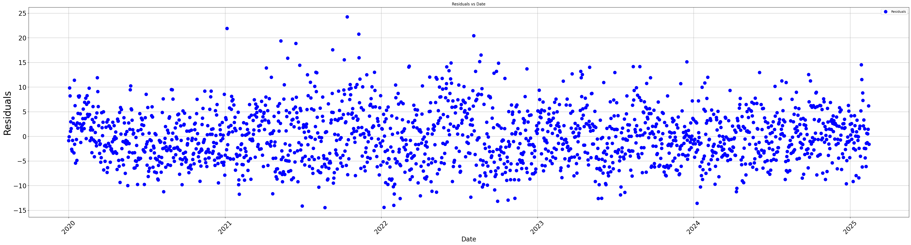
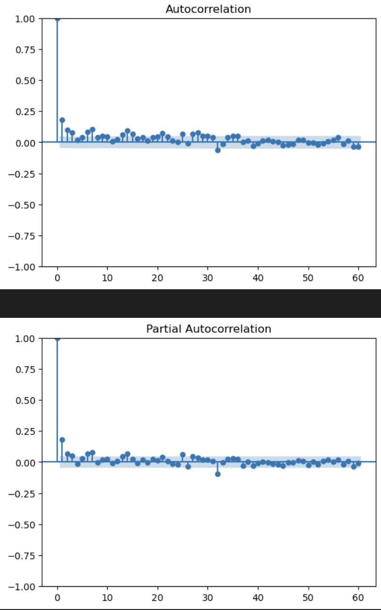
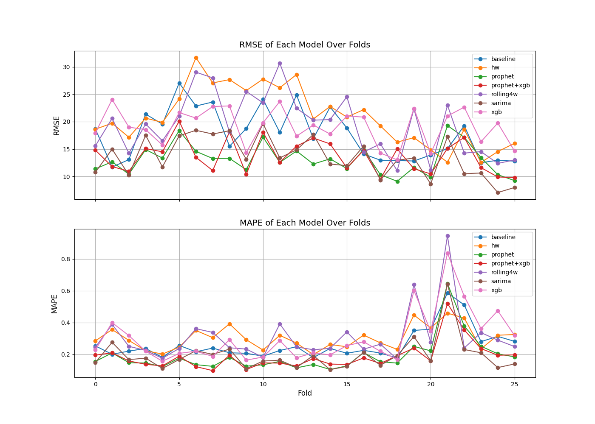
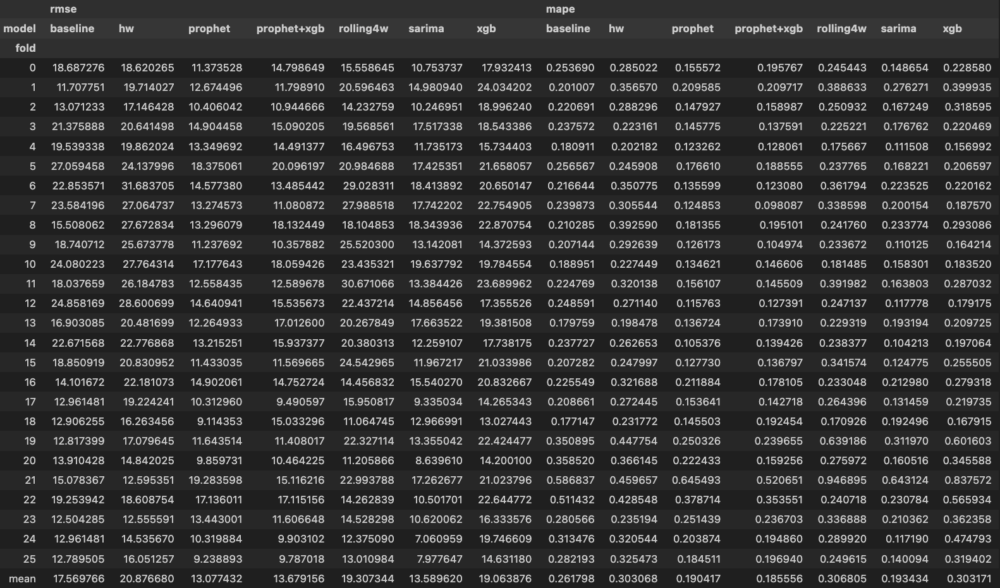
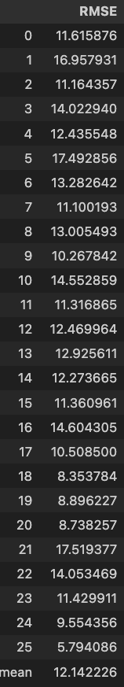
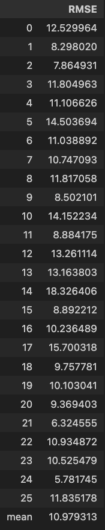

# Summary of Results

We collect the results of our modeling approach here. The date of last update is recorded for reference.

## Citywide (Last updated: March 17th, 2026)

The best performining model we found here was the Hyrbid model which uses Prophet and XGBoost. The Hybrid model takes Prophet's forecast, and produces the timeseries whose target values are the residuals of Prophet's forecast. Then, XGBoost's job is to predict the residuals of Prophet's forecast and our final prediction for the number of rats sighted will be the sum of Prophet's forecast and XGBoost's forecast.

  

The residuals show a lot of noise and there are significant outliers in the summer. We considered the ACF and PACF plots.

  

 
Off the top, we see that there is some signifcant autocorrelation (and partial autocorrelation) for lags <14. Unfortunately, lags <14 would still land inside of our forecast horizon.  We do see that there is some autocorrelation and partial autocorrelation at around the one month mark. We at minimum will consider lags of around 30 days and also lagged features of our data. Part of the reason why we also suspected that a hybrid model might perform well is because its mean RMSE was very close to the mean RMSE of Prophet which was the best model.

  

  

Using various features, whos selection was motivated by ACF and PACF plots above and how closely rat sightings seem to follow weather pattens, we tuned the parameters of XGBoost and its features. We used Optuna due to the need to have many trials and our usage of many features. Again, the plot of residuals indicated that there should be quite a bit of noise. We also did not want XGBoost to pickup on any noise too closely and so built the cross-validation method into the tuning process. In the end, the hybrid model had a mean RMSE of 12.14.

  

A fold by fold comparison showed that the hybrid model in most of the folds. Evaluation of the hybrid model showed that we had not overfitted or underfitted to the training data with out parameter and feature choices.

  

## Manhattan (Last updated: March 10th, 2026)

The best performing model we found was the Prophet model. For our walk-forward cross validation with 26 folds and 14 day forecast horizons, Prophet got an average RMSE of 4.58 beating out the second place contender of SARIMA which got an average RMSE of 4.98.

  

  

Next, we considered potential upgrades to Prophet. We tried both NeuralProphet and a Hybrid model using Prophet together with XGBoost. Our results (displayed below; left is NeuralProphet and right is the Hybrid Model) showed that NeuralProphet performed slightly better than Prophet, but not enough to justify the increased runtime for NeuralProphet. We used NeuralProphet's n_lags parameter and added regressors to it. Our choices were to use 'apparent_temperature_max', 'apparent_temperature_min', and 'snowfall_sum' obtained from Open-Meteo. Our work in the folder scr/features suggested that these features could be used to improve our model. As for the hybrid model, we many features for the XGBoost model on residuals.  We know from our work at the citywide level that the residuals exhibit a lot of noise and to account for that, we included a lot of features. We used Optuna's hyerparameter for this purpose. The results of one run is displayed to the right. We see that it actually performed worse in that run. We do have reasons to believe that we can improve on Prophet by tuning hyparameters some more. This is quite computationally intensive and have not made extended attempts to do that.

  
  &nbsp;&nbsp;&nbsp; &nbsp;&nbsp;&nbsp; &nbsp;&nbsp;&nbsp; &nbsp;&nbsp;&nbsp; &nbsp;&nbsp;&nbsp; &nbsp;&nbsp;&nbsp; &nbsp;&nbsp;&nbsp; &nbsp;&nbsp;&nbsp; &nbsp;&nbsp;&nbsp; &nbsp;&nbsp;&nbsp; 
    

## Brooklyn

## Staten Island

## Bronx

## Queens

## Weekly Forecasting
